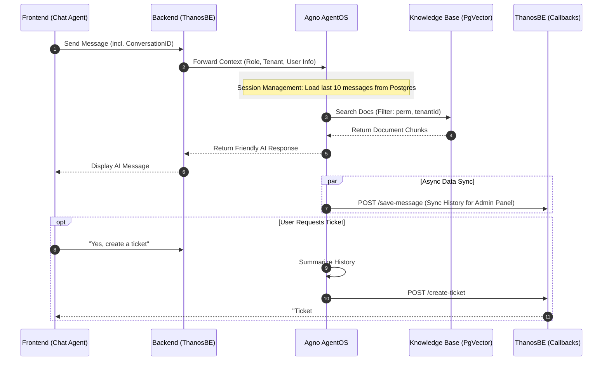

# Agno Role-Based Multi-Agent RAG: Integration Plan

This plan integrates the Agno framework into the Thanos ecosystem, replacing the legacy `RAG-CHAT-PROD-JulleySupport-THANOS` n8n workflow. It leverages Agno's native session management and metadata filtering to provide a robust, role-aware support experience.

## 1. System Architecture & Agent Workflow

The integrated flow follows a 3-tier architecture with a specialized Agent Team:



## 2. Phase 1: Agno AgentOS & Knowledge Base (Upsertion Logic)

In this phase, we transition from multiple tables to a unified metadata-driven approach. We will implement a Python script that **polls Google Drive** (replicating the n8n trigger) to fetch documents and upsert them into `cs_vectordb_v2`.

### Python: Google Drive Polling & Upsertion Logic

This script authenticates with Google Drive, watches for changes, and inserts documents into PgVector with the correct role-based metadata.

```python
from agno.knowledge.knowledge import Knowledge
from agno.vectordb.pgvector import PgVector
from googleapiclient.discovery import build
from google.oauth2 import service_account
import time
import os
from datetime import datetime

# Database configuration
DB_URL = "postgresql+psycopg://ai:ai@localhost:5432/thanos"
TABLE_NAME = "cs_vectordb_v2"
SERVICE_ACCOUNT_FILE = 'credentials.json'
FOLDER_ID = "1MqejgA65iohmi9Oqvq_6Y9AMucrONc_Y" # Target Folder ID

# 1. Setup Vector DB
vector_db = PgVector(
    table_name=TABLE_NAME,
    db_url=DB_URL,
    search_type="hybrid" # Vector + Full-text
)

# 2. Replicate n8n Permission Mapping
document_role_mapping = {
    "1k6uBRowoVMw62PKPdvA2mB7hfnwJniyd": {"roles": ["CUSTOMER_ADMIN", "ADMIN"], "perm": 0, "superperm": "1"},
    "14l-20sHn7xh86tIDK2_pemrTGcEEpprU": {"roles": ["TECHNICIAN", "ADMIN"], "perm": "3", "superperm": 0},
    "1w4-08CCssM7dB9LSQot-sGXFwvpNbjIN": {"roles": ["PILOT", "CUSTOMER_ADMIN", "ADMIN"], "perm": "1", "superperm": "1"},
    "1kE0NGpe9-UtIpSPMg5RPWq0AIWmC4hfL": {"roles": ["SENIOR_CS", "CUSTOMER_SUPPORT", "ADMIN"], "perm": "2", "superperm": "2"},
}

def upsert_document(file_path, file_id, file_name):
    """
    Inserts a document into PgVector with specific role-based metadata.
    """
    mapping = document_role_mapping.get(file_id, {"roles": ["ADMIN"], "perm": 0, "superperm": 0})
    
    metadata = {
        "file_id": file_id,
        "file_name": file_name,
        "perm": mapping["perm"],
        "superperm": mapping["superperm"],
        "allperm": 1 if "ADMIN" in mapping["roles"] else 0,
        "tenant_id": "Thanos",
        "source": "google_drive"
    }
    
    knowledge = Knowledge(vector_db=vector_db)
    knowledge.insert(path=file_path, metadata=metadata)
    print(f"✅ Upserted {file_name} with perm: {mapping['perm']}")

def sync_google_drive():
    """
    Syncs Google Drive folder to PgVector.
    """
    creds = service_account.Credentials.from_service_account_file(
        SERVICE_ACCOUNT_FILE, scopes=['https://www.googleapis.com/auth/drive.readonly'])
    service = build('drive', 'v3', credentials=creds)
    
    print(f"🔄 Syncing Google Drive Folder: {FOLDER_ID}")
    
    # Query for all files in folder
    query = f"'{FOLDER_ID}' in parents and trashed = false"
    results = service.files().list(q=query, fields="files(id, name)").execute()
    files = results.get('files', [])

    for file in files:
        print(f"📄 Processing: {file['name']} ({file['id']})")
        # Download and upsert
        file_content = service.files().get_media(fileId=file['id']).execute()
        local_path = f"/tmp/{file['name']}"
        with open(local_path, 'wb') as f:
            f.write(file_content)
        
        upsert_document(local_path, file['id'], file['name'])

if __name__ == "__main__":
    sync_google_drive()
```

## 3. Phase 2: Agent Team & Session Management

This phase focuses on the intelligence layer and context retention.

*   **Support Agent (The Core)**: 
    *   **Model**: Gemini 1.5 Flash.
    *   **Logic**: Performs hybrid search across `cs_vectordb_v2` using the `userRole` and `tenantId` from the request context to set security filters.
    *   **Persistence**: Uses `PostgresDb` to store the last 10 messages, ensuring users can continue conversations after a refresh.
    *   **Analyzer Agent (The Facilitator)**: 
        *   **Role**: Monitors the conversation for "Ticket Intent" OR "Successful Resolution," replicating the logic of n8n "AI Agent1" and "User Confirms Ticket?" nodes. It generates a structured summary of the conversation in both scenarios.
        *   **Tools**: Equipped with `create_support_ticket` and `save_conversation_summary` tools to perform callbacks to the Thanos Backend.

### Python: Agent Team & Ticket Tool Implementation
```python
from agno.agent import Agent
from agno.db.postgres import PostgresDb
from agno.models.google import Gemini
from agno.tools import tool
import requests

# Session Storage Configuration
db = PostgresDb(db_url=DB_URL, session_table="cs_agent_sessions")

@tool
def create_support_ticket(title: str, description: str, priority: str, category: str, conversation_id: str, user_id: str, tenant_id: str) -> str:
    """
    Creates a formal support ticket in the Thanos Backend via callback.
    """
    url = "https://backend-prod.julleyonline.co.in/api/v1/customer-support/agent-callback/ticket"
    payload = {
        "title": title, "description": description, "priority": priority,
        "category": category, "conversationId": conversation_id,
        "userId": user_id, "tenantId": tenant_id
    }
    response = requests.post(url, json=payload)
    if response.status_code == 201:
        return f"✅ Ticket created successfully: {response.json().get('data', {}).get('ticketNumber')}"
    return f"❌ Failed to create ticket: {response.text}"

@tool
def save_conversation_summary(conversation_id: str, summary: str, topic: str, resolution_status: str):
    """
    Persists the final conversation summary to the backend.
    """
    # Use existing n8n/conversation endpoint or create a specific summary endpoint 
    # matching the n8n logic: https://backend-prod.julleyonline.co.in/api/v1/customer-support/n8n/conversation
    url = "https://backend-prod.julleyonline.co.in/api/v1/customer-support/n8n/conversation" 
    payload = {
        "conversationId": conversation_id,
        "summary": summary,
        "topic": topic,
        # status mapping if needed by backend logic
    }
    requests.post(url, json=payload)
    return "Summary saved."

def get_support_team(user_context):
    # Support Agent for document retrieval and friendly guidance
    support_agent = Agent(
        name="Julley Support",
        model=Gemini(id="gemini-1.5-flash"),
        db=db,
        knowledge=Knowledge(vector_db=vector_db),
        search_knowledge=True,
        add_history_to_context=True,
        num_history_runs=10,
        instructions=[f"You are helping {user_context['userName']}. Answer only from docs."]
    )
    
    # Analyzer Agent for detecting when human escalation is needed
    analyzer_agent = Agent(
        name="Ticket Analyzer",
        model=Gemini(id="gemini-1.5-pro"),
        tools=[create_support_ticket, save_conversation_summary],
        instructions=[
            "Monitor conversation history for unresolved issues or explicit ticket requests.",
            "If the user says 'Thank you' or indicates the issue is resolved:",
            "  1. Generate a structured summary of the conversation.",
            "  2. Provide a friendly closing message (vary the phrasing).",
            "  3. Call the 'save_conversation_summary' tool to persist the summary.",
            "If the user confirms they want a ticket:",
            "  1. Summarize the main issue.",
            "  2. Use the 'create_support_ticket' tool.",
            "  3. Inform the user of the ticket ID."
        ]
    )
    
    return Agent(team=[support_agent, analyzer_agent])
```

## 4. Phase 3: ThanosBE Integration (Refactoring)

We must modify the backend service layer to switch from n8n webhooks to the Agno AgentOS endpoint.

*   **Service Layer Update**: Refactor `ChatServiceImpl.java` to construct the context-heavy JSON payload required by Agno.
*   **Callback Controller**: Update/Rename `N8nIntegrationController.java` to `AgentIntegrationController.java` to handle persistent storage requests (conversations/tickets) coming from Agno.

### Java: `ChatServiceImpl.java` Refactoring
```java
// Replace legacy n8n webhook call with Agno AgentOS call
private String callAgnoAgent(String message, String conversationId, String sessionId,
                              String tenantId, String userName, String userEmail, String jwtToken, String userId, String userRole) {
    try {
        Map<String, Object> payload = new HashMap<>();
        payload.put("message", message);
        payload.put("sessionId", sessionId);
        payload.put("conversationId", conversationId);
        payload.put("tenantId", tenantId);
        payload.put("userName", userName);
        payload.put("userEmail", userEmail);
        payload.put("userRole", userRole);
        payload.put("accessToken", jwtToken);

        HttpHeaders headers = new HttpHeaders();
        headers.setContentType(MediaType.APPLICATION_JSON);
        HttpEntity<Map<String, Object>> request = new HttpEntity<>(payload, headers);

        String agnoUrl = "https://agno-agent-prod.julleyonline.co.in/chat"; 
        ResponseEntity<Map> response = restTemplate.postForEntity(agnoUrl, request, Map.class);

        return response.getBody().get("output").toString();
    } catch (Exception e) {
        log.error("Error calling Agno AgentOS", e);
        return "I'm having trouble connecting to my knowledge base. Please try again.";
    }
}
```

## 5. Phase 4: Frontend Integration (ThanosFE)

The existing frontend architecture is already compatible. No logic changes are required in the client package, ensuring a zero-disruption rollout.

*   **Endpoint Stability**: The `julley-chat-agent` continues to hit the same `/chat/message` endpoint.
*   **Context Continuity**: The BE handles all context injection, so the FE remains lightweight and focused on UI/UX.

## 6. Communication Payloads

### A. ThanosBE to Agno AgentOS (`POST /agno/chat`)
```json
{
  "message": "My drone is not responding.",
  "sessionId": "jwt-session-id",
  "conversationId": "uuid-123",
  "tenantId": "customer-abc",
  "userName": "John Doe",
  "userRole": "PILOT"
}
```

### B. Agno Callback to ThanosBE (Create Ticket)
```json
{
  "title": "Drone Communication Failure",
  "description": "User reported drone not responding. Summary: ...",
  "conversationId": "uuid-123",
  "priority": "HIGH",
  "category": "Technical"
}
```

## 7. Chat History & Session Revisit Logic

### A. Agno Persistence: `cs_agent_sessions` Table
Agno automatically creates and manages the `cs_agent_sessions` table if it doesn't exist when the `PostgresDb` is initialized.

**1. Implementation Code (Python Agent)**
In `Phase 2`, the agent initialization sets up the connection:
```python
# Session Storage Configuration
# Agno auto-creates table "cs_agent_sessions" if missing
db = PostgresDb(
    db_url=DB_URL, 
    session_table="cs_agent_sessions"
)

support_agent = Agent(
    ...,
    db=db,
    add_history_to_context=True, # Loads last N messages
    num_history_runs=10          # Window size
)
```

**2. Manual Table Schema (Reference)**
If you prefer to create it manually via SQL migration (recommended for production control):
```sql
CREATE TABLE IF NOT EXISTS cs_agent_sessions (
    session_id TEXT PRIMARY KEY,
    user_id TEXT,
    memory JSONB,
    session_data JSONB,
    created_at TIMESTAMP WITH TIME ZONE DEFAULT CURRENT_TIMESTAMP,
    updated_at TIMESTAMP WITH TIME ZONE DEFAULT CURRENT_TIMESTAMP
);
```

### B. ThanosBE Audit: Async Callback
Every message turn is synced to the primary ThanosBE database for long-term storage and admin visibility.

**1. Sync Flow**
1.  **User Message**: Received by Agno → Stored in `cs_agent_sessions` (Active Memory).
2.  **AI Response**: Generated by Agno → Stored in `cs_agent_sessions` (Active Memory).
3.  **Callback**: Agno triggers a background task to call `POST /api/v1/customer-support/agent-callback/messages`.

**2. Implementation (Python Agent Hook)**
Add an `after_run` hook to the Support Agent to trigger the sync:

```python
def sync_to_backend(agent, response):
    # Prepare payload for ThanosBE
    payload = {
        "conversationId": agent.session_id,
        "userId": agent.user_id, 
        "messages": [
            {"senderType": "user", "content": agent.last_user_message},
            {"senderType": "ai", "content": response.content}
        ]
    }
    # Async call to Backend (fire and forget)
    # URL matches n8n "Save Messages1" node
    requests.post("https://backend-prod.julleyonline.co.in/api/v1/customer-support/n8n/messages", json=payload)

support_agent = Agent(
    ...,
    after_run=[sync_to_backend]
)
```

## 8. Step-by-Step Implementation

| Step | Action | Owner |
| :--- | :--- | :--- |
| 1 | Setup Agno AgentOS with `PostgresDb` storage for sessions | DevOps/AI |
| 2 | Run Python Ingestion Script to populate `cs_vectordb_v2` | AI |
| 3 | Deploy Agno Agent Team with metadata filtering logic | AI |
| 4 | Update `ThanosBE` to forward requests to Agno and handle ticket callbacks | Backend |
| 5 | End-to-end verification of role-based document access | QA |
