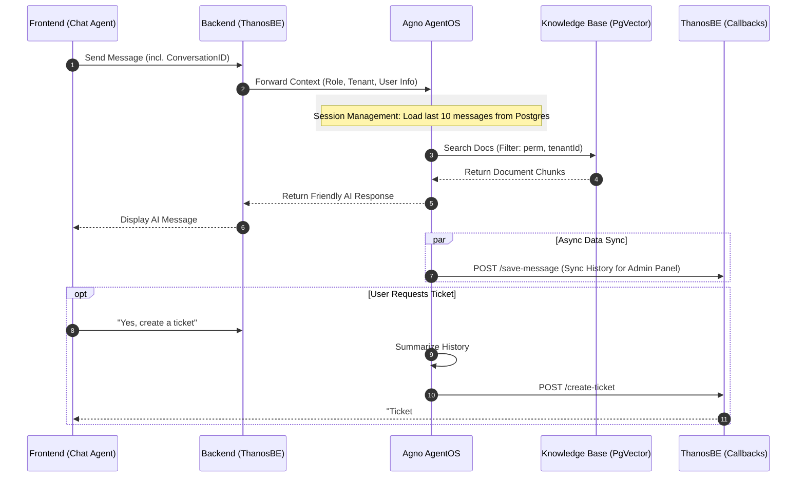

# Agno Role-Based Multi-Agent RAG: Integration Plan

This plan integrates the Agno framework into the Thanos ecosystem, replacing the legacy `RAG-CHAT-PROD-JulleySupport-THANOS` n8n workflow. It leverages Agno's native session management and metadata filtering to provide a robust, role-aware support experience.

## 1. System Architecture & Agent Workflow

The integrated flow follows a 3-tier architecture with a specialized Agent Team:



## 2. Phase 1: Agno AgentOS & Knowledge Base (Upsertion Logic)

In this phase, we transition from multiple tables to a unified metadata-driven approach. We will implement a Python script that **polls Google Drive** (replicating the n8n trigger) to fetch documents and upsert them into `cs_vectordb_v2`.

### Python: Google Drive Polling & Upsertion Logic

This script authenticates with Google Drive, watches for changes, and inserts documents into PgVector with the correct role-based metadata.

```python
from agno.knowledge.knowledge import Knowledge
from agno.vectordb.pgvector import PgVector
from googleapiclient.discovery import build
from google.oauth2 import service_account
import time
import os
from datetime import datetime

# Database configuration
DB_URL = os.getenv("DATABASE_URL")
TABLE_NAME = "cs_agno_vectordb1"
SERVICE_ACCOUNT_FILE = 'credentials.json'
FOLDER_ID = "1MqejgA65iohmi9Oqvq_6Y9AMucrONc_Y" # Target Folder ID

# 1. Setup Vector DB
vector_db = PgVector(
    table_name=TABLE_NAME,
    db_url=DB_URL,
    search_type="hybrid" # Vector + Full-text
)

# 2. Replicate n8n Permission Mapping
document_role_mapping = {
    "1k6uBRowoVMw62PKPdvA2mB7hfnwJniyd": {"roles": ["CUSTOMER_ADMIN", "ADMIN"], "perm": 0, "superperm": "1"},
    "14l-20sHn7xh86tIDK2_pemrTGcEEpprU": {"roles": ["TECHNICIAN", "ADMIN"], "perm": "3", "superperm": 0},
    "1w4-08CCssM7dB9LSQot-sGXFwvpNbjIN": {"roles": ["PILOT", "CUSTOMER_ADMIN", "ADMIN"], "perm": "1", "superperm": "1"},
    "1kE0NGpe9-UtIpSPMg5RPWq0AIWmC4hfL": {"roles": ["SENIOR_CS", "CUSTOMER_SUPPORT", "ADMIN"], "perm": "2", "superperm": "2"},
}

def upsert_document(file_path, file_id, file_name):
    """
    Inserts a document into PgVector with specific role-based metadata.
    """
    mapping = document_role_mapping.get(file_id, {"roles": ["ADMIN"], "perm": 0, "superperm": 0})
    
    metadata = {
        "file_id": file_id,
        "file_name": file_name,
        "perm": mapping["perm"],
        "superperm": mapping["superperm"],
        "allperm": 1 if "ADMIN" in mapping["roles"] else 0,
        "tenant_id": "Thanos",
        "source": "google_drive"
    }
    
    knowledge = Knowledge(vector_db=vector_db)
    knowledge.insert(path=file_path, metadata=metadata)
    print(f"✅ Upserted {file_name} with perm: {mapping['perm']}")

def sync_google_drive():
    """
    Syncs Google Drive folder to PgVector.
    """
    creds = service_account.Credentials.from_service_account_file(
        SERVICE_ACCOUNT_FILE, scopes=['https://www.googleapis.com/auth/drive.readonly'])
    service = build('drive', 'v3', credentials=creds)
    
    print(f"🔄 Syncing Google Drive Folder: {FOLDER_ID}")
    
    # Query for all files in folder
    query = f"'{FOLDER_ID}' in parents and trashed = false"
    results = service.files().list(q=query, fields="files(id, name)").execute()
    files = results.get('files', [])

    for file in files:
        print(f"📄 Processing: {file['name']} ({file['id']})")
        # Download and upsert
        file_content = service.files().get_media(fileId=file['id']).execute()
        local_path = f"/tmp/{file['name']}"
        with open(local_path, 'wb') as f:
            f.write(file_content)
        
        upsert_document(local_path, file['id'], file['name'])

if __name__ == "__main__":
    sync_google_drive()
```

## 3. Phase 2: Agent Team & Session Management

This phase focuses on replicating the agentic logic from the production n8n workflow, ensuring precise input validation, permission-based tool routing, and dual-purpose session management.

### A. Input Validation & Identity Mapping
Every request to the Agno AgentOS will first pass through a validation layer (replicating the "Validate Input1" node).

```python
def validate_user_context(payload):
    # Map UserRole to permission flags
    ROLE_MAP = {
        "PILOT": {"perm": "1", "superperm": 0, "allperm": 0},
        "CUSTOMER_SUPPORT": {"perm": "2", "superperm": 0, "allperm": 0},
        "TECHNICIAN": {"perm": "3", "superperm": 0, "allperm": 0},
        "CUSTOMER_ADMIN": {"perm": 0, "superperm": "1", "allperm": 0},
        "SENIOR_CS": {"perm": 0, "superperm": "2", "allperm": 0},
        "ADMIN": {"perm": 0, "superperm": 0, "allperm": 1},
        "USER": {"perm": "2", "superperm": 0, "allperm": 0} # Fallback
    }
    role = payload.get("userRole", "USER").upper()
    perms = ROLE_MAP.get(role, ROLE_MAP["USER"])
    
    return {
        "message": payload.get("message"),
        "conversationId": payload.get("conversationId"),
        "sessionId": payload.get("sessionId"),
        "accessToken": payload.get("accessToken"),
        "userName": payload.get("userName", "Unknown"),
        "userEmail": payload.get("userEmail", "Not provided"),
        **perms
    }
```

### B. Agent Implementation
We use a specialized Team approach to handle RAG queries and structural conversation analysis.

#### 1. Support Agent (The Responder)
*   **Prompt**: Follows `prompt.md` strictly.
*   **Logic**: Uses permission-based tool selection. If `perm != 0`, it uses the `PERMISSIONS` tool. If `superperm != 0`, it uses `SUPERPERMISSIONS`. If `allperm != 0`, it uses `ADMIN`.
*   **Knowledge**: Searches `cs_agno_vectordb1` (Schema: `ai`).

#### 2. Analyzer Agent (The Task Master)
*   **Role**: Detects when a conversation has ended or when a ticket is requested (replicating "Rename response variable" and "AI Agent1").
*   **Logic**: Parses the final turn to decide between standard message saving or full ticket escalation.

### C. Backend API Configurations

#### 1. Save Messages API (Standard Chat Flow)
**Endpoint**: `POST /api/v1/customer-support/n8n/messages`
**Trigger**: Every message turn where no ticket is created (n8n "Save Messages1" node).
```json
{
  "Authorization": "Bearer {{accessToken}}",
  "conversationId": "uuid-123",
  "userId": "user-456",
  "tenantId": "customer-abc",
  "sessionId": "session-xyz",
  "userName": "John Doe",
  "userEmail": "john@example.com",
  "timestamp": "2024-01-01T12:00:00Z",
  "messages": [
    {"senderType": "user", "content": "..."},
    {"senderType": "assistant", "content": "..."}
  ]
}
```

#### 2. Create Ticket API (Escalation Flow)
**Endpoint**: `POST /api/v1/customer-support/n8n/ticket`
**Trigger**: User confirms ticket intent (n8n "Create Ticket1" node).
```json
{
  "Authorization": "Bearer {{accessToken}}",
  "conversationId": "uuid-123",
  "userId": "user-456",
  "title": "Topic from Analyzer",
  "description": "Main Issue from Analyzer",
  "summary": "Full summary from Analyzer",
  "userName": "John Doe",
  "userEmail": "john@example.com",
  "conversationHistory": [...],
  "timestamp": "..."
}
```

#### 3. Save Conversation API (Closer Flow)
**Endpoint**: `POST /api/v1/customer-support/n8n/conversation`
**Trigger**: When a conversation is ended/ticketed (n8n "Save Conversation (Ticket)1" node).
```json
{
  "Authorization": "Bearer {{accessToken}}",
  "topic": "Brief category",
  "description": "Short problem description",
  "summary": "Detailed narrative summary",
  "messageCount": 5,
  "closedAt": 171XXXXXXX
}
```

### D. Memory Management & Database Schema

The system utilizes two levels of memory to enable session continuity and historical retrieval.

#### 1. Short-Term Memory (Active Session)
*   **Mechanism**: Agno `PostgresDb` session storage.
*   **Behavior**: Handled via `sessionId`. Each `sessionId` maintains a discrete context window for the current interaction.

#### 2. Long-Term Memory (History Retrieval)
*   **Mechanism**: Periodic sync to Thanos Backend (`cs_chat_memory`).
*   **Behavior**: When a user returns or starts a "New Chat" vs. "History Chat," the system matches the `conversationId`.

#### Database Schema: `cs_agno_longterm_memory` (For Continuation Logic)
This table stores the ground truth for all sessions, allowing users to pick up where they left off.

```sql
CREATE TABLE ai.cs_agno_longterm_memory (
    id SERIAL PRIMARY KEY,
    session_id VARCHAR(255),
    conversation_id VARCHAR(255),
    user_id VARCHAR(255),
    tenant_id VARCHAR(255),
    message JSONB, -- Stores {type: 'human'/'ai', content: '...'}
    created_at TIMESTAMP DEFAULT CURRENT_TIMESTAMP
);
```

### Agent Memory Initialization Code
```python
db = PostgresDb(db_url=DB_URL, session_table="cs_agno_longterm_memory", db_schema="ai")

agent = Agent(
    team=[support_agent, analyzer_agent],
    db=db,
    # Context Loading Logic:
    # 1. If conversationId exists in request, pre-load history from cs_chat_memory
    # 2. Store current turn into cs_agno_longterm_memory for immediate speed
    # 3. Async push to Thanos Backend for persistent long-term visibility
)
```


## 4. Phase 3: ThanosBE Integration (Refactoring)

We must modify the backend service layer to switch from n8n webhooks to the Agno AgentOS endpoint.

*   **Service Layer Update**: Refactor `ChatServiceImpl.java` to construct the context-heavy JSON payload required by Agno.
*   **Callback Controller**: Update/Rename `N8nIntegrationController.java` to `AgentIntegrationController.java` to handle persistent storage requests (conversations/tickets) coming from Agno.

### Java: `ChatServiceImpl.java` Refactoring
```java
// Replace legacy n8n webhook call with Agno AgentOS call
private String callAgnoAgent(String message, String conversationId, String sessionId,
                              String tenantId, String userName, String userEmail, String jwtToken, String userId, String userRole) {
    try {
        Map<String, Object> payload = new HashMap<>();
        payload.put("message", message);
        payload.put("sessionId", sessionId);
        payload.put("conversationId", conversationId);
        payload.put("tenantId", tenantId);
        payload.put("userName", userName);
        payload.put("userEmail", userEmail);
        payload.put("userRole", userRole);
        payload.put("accessToken", jwtToken);

        HttpHeaders headers = new HttpHeaders();
        headers.setContentType(MediaType.APPLICATION_JSON);
        HttpEntity<Map<String, Object>> request = new HttpEntity<>(payload, headers);

        String agnoUrl = "https://agno-agent-prod.julleyonline.co.in/chat"; 
        ResponseEntity<Map> response = restTemplate.postForEntity(agnoUrl, request, Map.class);

        return response.getBody().get("output").toString();
    } catch (Exception e) {
        log.error("Error calling Agno AgentOS", e);
        return "I'm having trouble connecting to my knowledge base. Please try again.";
    }
}
```

## 5. Phase 4: Frontend Integration (ThanosFE)

The existing frontend architecture is already compatible. No logic changes are required in the client package, ensuring a zero-disruption rollout.

*   **Endpoint Stability**: The `julley-chat-agent` continues to hit the same `/chat/message` endpoint.
*   **Context Continuity**: The BE handles all context injection, so the FE remains lightweight and focused on UI/UX.

## 6. Communication Payloads

### A. ThanosBE to Agno AgentOS (`POST /agno/chat`)
```json
{
  "message": "My drone is not responding.",
  "sessionId": "jwt-session-id",
  "conversationId": "uuid-123",
  "tenantId": "customer-abc",
  "userName": "John Doe",
  "userRole": "PILOT"
}
```

### B. Agno Callback to ThanosBE (Create Ticket)
```json
{
  "title": "Drone Communication Failure",
  "description": "User reported drone not responding. Summary: ...",
  "conversationId": "uuid-123",
  "priority": "HIGH",
  "category": "Technical"
}
```

## 7. Chat History & Session Revisit Logic

### A. Agno Persistence: `cs_agno_longterm_memory` Table
Agno automatically creates and manages the `cs_agno_longterm_memory` table if it doesn't exist when the `PostgresDb` is initialized.

**1. Implementation Code (Python Agent)**
In `Phase 2`, the agent initialization sets up the connection:
```python
# Session Storage Configuration
# Agno auto-creates table "cs_agno_longterm_memory" if missing
db = PostgresDb(
    db_url=DB_URL, 
    session_table="cs_agno_longterm_memory",
    db_schema="ai"
)

support_agent = Agent(
    ...,
    db=db,
    add_history_to_context=True, # Loads last N messages
    num_history_runs=10          # Window size
)
```

**2. Manual Table Schema (Reference)**
If you prefer to create it manually via SQL migration (recommended for production control):
```sql
CREATE TABLE IF NOT EXISTS ai.cs_agno_longterm_memory (
    session_id TEXT PRIMARY KEY,
    user_id TEXT,
    memory JSONB,
    session_data JSONB,
    created_at TIMESTAMP WITH TIME ZONE DEFAULT CURRENT_TIMESTAMP,
    updated_at TIMESTAMP WITH TIME ZONE DEFAULT CURRENT_TIMESTAMP
);
```

### B. ThanosBE Audit: Async Callback
Every message turn is synced to the primary ThanosBE database for long-term storage and admin visibility.

**1. Sync Flow**
1.  **User Message**: Received by Agno → Stored in `cs_agno_longterm_memory` (Active Memory).
2.  **AI Response**: Generated by Agno → Stored in `cs_agno_longterm_memory` (Active Memory).
3.  **Callback**: Agno triggers a background task to call `POST /api/v1/customer-support/agent-callback/messages`.

**2. Implementation (Python Agent Hook)**
Add an `after_run` hook to the Support Agent to trigger the sync:

```python
def sync_to_backend(agent, response):
    # Prepare payload for ThanosBE
    payload = {
        "conversationId": agent.session_id,
        "userId": agent.user_id, 
        "messages": [
            {"senderType": "user", "content": agent.last_user_message},
            {"senderType": "ai", "content": response.content}
        ]
    }
    # Async call to Backend (fire and forget)
    # URL matches n8n "Save Messages1" node
    requests.post("https://backend-prod.julleyonline.co.in/api/v1/customer-support/n8n/messages", json=payload)

support_agent = Agent(
    ...,
    after_run=[sync_to_backend]
)
```

## 9. API Server Implementation & Deployment

To move from n8n webhooks to a dedicated Agno service, we will wrapping the Agent Team in a **FastAPI** application. This service will act as the unified "Brain" receiving requests from the Thanos Backend.

### A. FastAPI Server Implementation (`main.py`)
This script initializes the Agno Team and exposes the `/chat` endpoint.

```python
from fastapi import FastAPI, HTTPException, Request
from agno.agent import Agent
from .agents import get_support_team # Logic from Phase 2

app = FastAPI(title="Agno AgentOS Service")

@app.post("/chat")
async def handle_chat(request: Request):
    payload = await request.json()
    
    # 1. Validate Context (Logic from Phase 2)
    user_context = validate_user_context(payload)
    
    # 2. Initialize Team with Session ID
    # Agno uses session_id to automatically pull history from Postgres
    team = get_support_team(user_context)
    
    # 3. Execute Run
    # The 'message' is the user's current query
    response = team.run(
        message=user_context["message"],
        session_id=user_context["conversationId"] 
    )
    
    return {"output": response.content}

if __name__ == "__main__":
    import uvicorn
    uvicorn.run(app, host="0.0.0.0", port=8000)
```

### B. Deployment Strategy (Docker)

We will package the service into a lightweight Docker container for consistent deployment across environments.

**Dockerfile:**
```dockerfile
FROM python:3.11-slim

WORKDIR /app
COPY requirements.txt .
RUN pip install --no-cache-dir -r requirements.txt

COPY . .

# Use Gunicorn with Uvicorn workers for production stability
CMD ["gunicorn", "-w", "4", "-k", "uvicorn.workers.UvicornWorker", "main:app", "--bind", "0.0.0.0:8000"]
```

### C. Environment Configuration
The following variables must be set in the deployment environment (e.g., Docker Secret, K8s ConfigMap):
*   `GOOGLE_API_KEY`: For Gemini 1.5 Access.
*   `DATABASE_URL`: Connection string for Thanos Postgres (PgVector).
*   `THANOS_BE_URL`: URL for Thanos Backend (for callbacks).
*   `THANOS_API_KEY`: Security key for Agno-to-Backend communication.

## 10. Updated Step-by-Step Implementation

| Step | Action | Owner |
| :--- | :--- | :--- |
| 1 | Setup Agno AgentOS with `PostgresDb` (`cs_agno_longterm_memory`) storage for sessions | DevOps/AI |
| 2 | Run Python Ingestion Script to populate `cs_agno_vectordb1` | AI |
| 3 | Develop FastAPI wrapper with `/chat` and `/health` endpoints | AI |
| 4 | Deploy Agno Service to Production via Docker (Gunicorn/Uvicorn) | DevOps |
| 5 | Update `ThanosBE` to forward requests to Agno and handle ticket callbacks | Backend |
| 6 | End-to-end verification of role-based document access and ticket creation | QA |
| 7 | Decommission legacy n8n chat nodes | DevOps |
